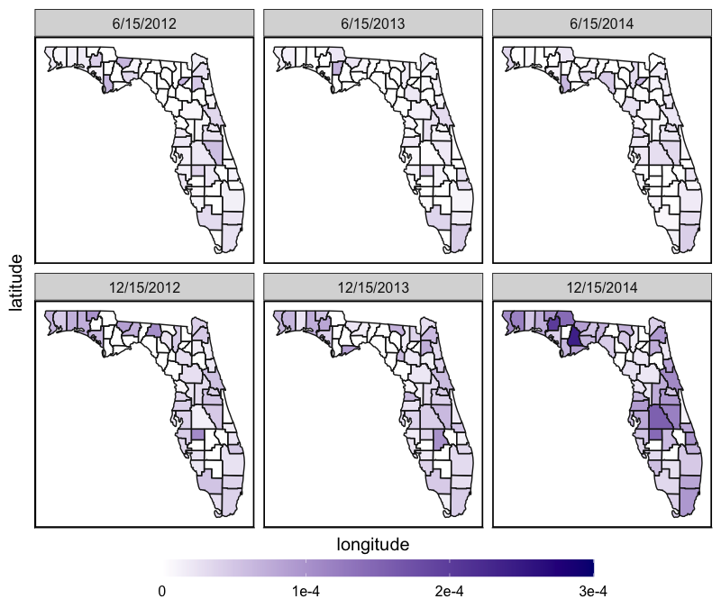
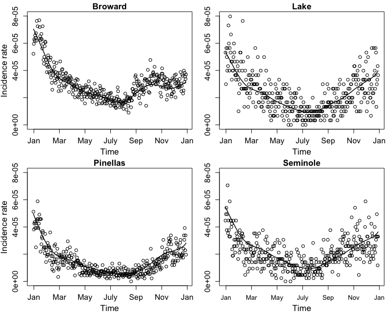
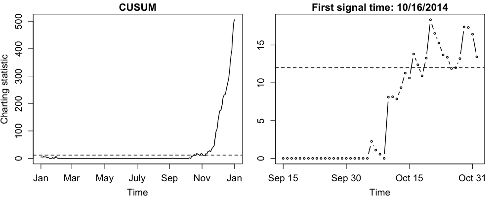
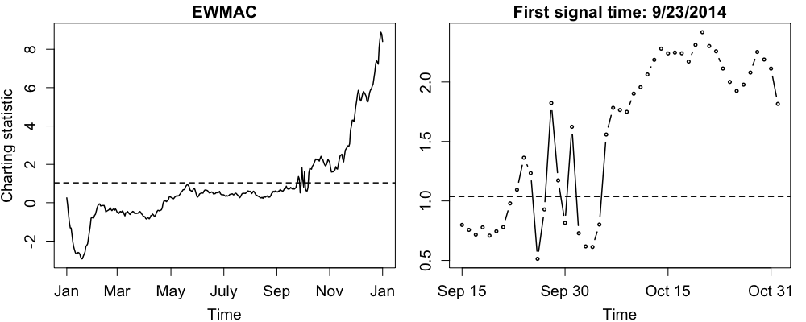
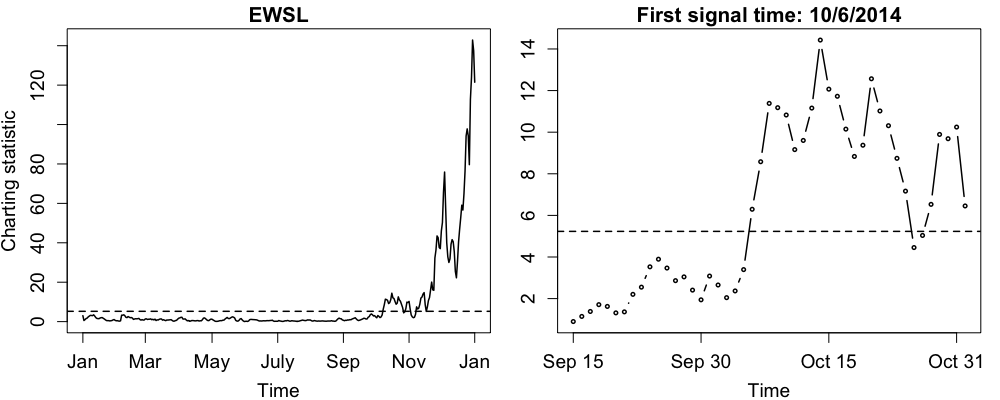

<style>
body {
text-align: justify}
</style>

```{r, include = FALSE}
knitr::opts_chunk$set(
  warning = FALSE,
  collapse = TRUE,
  comment = "#>"
)
```

```{r setup, echo = FALSE}
library(SpTe2M)
```

## Introduction

Spatio-temporal data are common in practice. Such data often have complex structures 
that are difficult to describe and estimate. To overcome this difficulty, the `R`
package **SpTe2M** has been developed to estimate the underlying spatio-temporal mean 
and covariance structures. This package also includes tools of online process monitoring 
to detect change-points in a spatio-temporal process over time. More specifically, it 
implements the nonparametric spatio-temporal data modeling methods described in Yang 
and Qiu (2018, 2019, and 2022), as well as the online spatio-temporal process monitoring 
methods discussed in Qiu and Yang (2021 and 2023) and Yang and Qiu (2020). In this 
vignette, we will demonstrate the main functions in **SpTe2M** by using the Florida 
influenza-like illness (ILI) data, which is a built-in dataset of the package.

## Florida ILI Data

The Florida ILI dataset, named as `ili_dat` in **SpTe2M**, contains daily ILI 
incidence rates at 67 Florida counties during years 2012-2014. The observed IIL
incidence rates was collected by the Electronic Surveillance System for the Early 
Notification of Community-based Epidemics of the Florida Department of Health. 
In addition to observations of the variable `Rate` (i.e., ILI incidence rate), 
the dataset also includes observations of the following 7 variables: `County`, 
`Date`, `Lat` (i.e., latitude of the geometric 
center of a county), `Long` (i.e., longitude of the geometric center of a county), 
`Time`, `Temp` (i.e., air temperature), and `RH` (i.e., relative humidity). First 
of all, let us install and load the package **SpTe2M** and take a quick look at the 
ILI data.

### Load ILI data

First, we run the following `R` code to install the package from CRAN and load 
the package in `R`:
```{r,eval=FALSE}
install.packages("SpTe2M")
library(SpTe2M)
```

Then, we read the built-in dataset `ili_dat` and use the `R` function 
`head()` to display its first 6 rows.
```{r}
data(ili_dat)
head(ili_dat)
```

### Create ILI maps
Next, we make some geographic maps to investigate the spatio-temporal patterns
of the ILI incidence. To do this, we first combine `ili_dat` with the map shape files 
included in the packages **maps** and **mapproj** and then create maps by using 
the function `ggplot()` in the package **ggplot2**.

```{r, fig.height = 6, fig.width = 7, fig.align = "center", eval=FALSE}
library(maps)
library(ggplot2)
library(mapproj)
# turn shape files in the maps packages into a data frame
FL <- map_data('county','florida')
names(FL)[6] <- 'County'
# Only plot maps on Jun 15 and Dec 15
subdat <- subset(ili_dat,Date%in%c('6/15/2012','6/15/2013','6/15/2014',
                          '12/15/2012','12/15/2013','12/15/2014'))
subdat$Date <- factor(subdat$Date,levels=c('6/15/2012','6/15/2013','6/15/2014',
                                       '12/15/2012','12/15/2013','12/15/2014'))
# merge ILI data with map data
mydat <- merge(FL,subdat)
# make maps using ggplot
maps <- ggplot(data=mydat,aes(long,lat,group=group,fill=Rate))+geom_polygon()+
  facet_wrap(~Date,ncol=3)+geom_path(colour='grey10',lwd=0.5)+
  scale_fill_gradient2('',low='cyan',mid='white',high='navy',
                       guide='colorbar',limits=c(0,0.0003),na.value='orange', 
                       breaks=c(0,0.0001,0.0002,0.0003), 
                       labels=c('0','1e-4','2e-4','3e-4'))+
  guides(fill=guide_colorbar(barwidth=25,barheight=1,direction='horizontal'),
         cex=1)+theme_bw(base_size=15)+xlab('longitude')+ylab('latitude')+
  theme(legend.position='bottom',
        axis.ticks=element_blank(),
        line=element_blank(),
        axis.text=element_blank(),
        panel.border=element_rect(color='black',linewidth=1.2),
        axis.line=element_line(colour='black'),
        legend.margin=margin(-10,0,0,0),
        legend.box.margin=margin(0,0,0,0))
# display the maps
maps
```
<center>
{width="90%"}
</center>
From the maps, it can be seen that ILI incidence rates have obvious seasonal 
patterns with more ILI cases in the winters and fewer ILI cases in the summers. 
Moreover, there seems to be an unusual pattern of ILI incidence rates in the winter 
of 2014 because the incidence rates on 12/15/2014 are much higher than those on 
12/15/2012 and 12/15/2013. Next, we appply the package **SpTe2M** to this dataset 
to estimate the spatio-temporal mean and covariance structures and monitor the ILI 
incidence sequentially over time.

## ILI Data Modeling

In this part, we estimate the spatio-temporal mean and covariance structures in 
year 2013 by using the functions `spte_meanest()` and `spte_covest()` in 
**SpTe2M**. To this end, we first use the following code to extract the observed
ILI data in year 2013.
```{r, eval=FALSE}
n <- 365; m <- 67; N1 <- (n+1)*m; N2 <- n*m
# extract the observed ILI data in year 2013
ili13 <- ili_dat[(N1+1):(N1+N2),]
y13 <- ili13$Rate; st13 <- ili13[,c('Lat','Long','Time')]
```

### Estimate spatio-temporal mean

After obtaining the ILI data in year 2013, the spatio-temporal mean structure can be 
estimated by applying the function `spte_meanest()` to the extracted data.
```{r, eval=FALSE}
# estimate the mean
mu.est <- spte_meanest(y=y13,st=st13)
```
Note that we don't specify the arguments `ht` and `hs` when using the function
`spte_meanest()`. In such a case, the two bandwidths `ht` and `hs` would be selected 
automatically by the modified cross-validation procedure (cf., Yang and Qiu 2018).

To visually check whether the estimated means describe the observed ILI data well, 
we use the code below to plot the estimated means for the 4 Florida counties Broward,
Lake, Pinellas, and Seminole, along with the observed ILI incidence rates at the 4
counties.
```{r, fig.height = 6, fig.width = 7, fig.align = "center", eval=FALSE}
mu <- mu.est$muhat; mu <- t(matrix(mu,m,n))
obs <- t(matrix(y13,m,n))
ids <- c(6,34,52,57) # IDs for Broward, Lake, Pinellas, Seminole
par(mfrow=c(2,2),mgp=c(2.4,1,0))
par(mar=c(3.5,3.5,1.5,0.5))
plot(1:365,mu[,ids[1]],type='l',lty=1,lwd=1.5,xaxt='n',
     ylim=c(0,8e-5),main='Broward',xlab='Time',ylab='Incidence rate',
     cex=1.2,cex.lab=1.3,cex.axis=1.2,cex.main=1.3)
points(1:365,obs[,ids[1]],cex=1)
axis(1,cex.axis=1.2,at=c(1+c(1,62,123,184,245,306, 367)),
     label=c('Jan','Mar','May','July','Sep','Nov','Jan'))
par(mar=c(3.5,3,1.5,1))
plot(1:365,mu[,ids[2]],type='l',lty=1,lwd=1.5,xaxt='n',
     ylim=c(0,8e-5),main='Lake',xlab='Time',ylab='',
     cex=1.2,cex.lab=1.3,cex.axis=1.2,cex.main=1.3)
points(1:365,obs[,ids[2]],cex=1)
axis(1,cex.axis=1.2,at=c(1+c(1,62,123,184,245,306, 367)),
     label=c('Jan','Mar','May','July','Sep','Nov','Jan'))
par(mar=c(3.5,3.5,1.5,0.5))
plot(1:365,mu[,ids[3]],type='l',lty=1,lwd=1.5,xaxt='n',
     ylim=c(0,8e-5),main='Pinellas',xlab='Time',ylab='Incidence rate',
     cex=1.2,cex.lab=1.3,cex.axis=1.2,cex.main=1.3)
points(1:365,obs[,ids[3]],cex=1)
axis(1,cex.axis=1.2,at=c(1+c(1,62,123,184,245,306, 367)),
     label=c('Jan','Mar','May','July','Sep','Nov','Jan'))
par(mar=c(3.5,3,1.5,1))
plot(1:365,mu[,ids[4]],type='l',lty=1,lwd=1.5,xaxt='n',
     ylim=c(0,8e-5),main='Seminole',xlab='Time',ylab=' ',
     cex=1.2,cex.lab=1.3,cex.axis=1.2,cex.main=1.3)
points(1:365,obs[,ids[4]],cex=1)
axis(1.2,at=c(1+c(1,62,123,184,245,306, 367)),
     label=c('Jan','Mar','May','July','Sep','Nov','Jan'))
```

<center>
{width="90%"}
</center>

It can be seen from the figure that the estimated spatio-temporal mean structure can 
well describe the longitudinal pattern of the observed ILI incidence rates. Thus,
the function `spte_meanest()` provides a reliable tool for estimating the spatio-temporal
mean function of the ILI data.

### Estimate spatio-temporal covariance

To estimate the spatio-temporal covariance, we can use the following code:
```{r, eval=FALSE}
# estimate the covariance
cov.est <- spte_covest(y=y13,st=st13)
```
In the above command, we don't specify the arguments `gt` and `gs`. Then, the two 
bandwidths `gt` and `gs` would be determined automatically by minimizing the mean 
squared prediction error, as discussed in Yang and Qiu (2019). 

## ILI Data Monitoring

In this part, we discuss how to monitor the observed ILI data by using the functions
`sptemnt_cusum()`, `sptemnt_ewmac()` and `sptemnt_ewsl()`, which correspond
to the CUSUM chart (Yang and Qiu 2020), the EWMAC chart (Qiu and Yang 2021) and
the EWSL chart (Qiu and Yang 2023), respectively. 

### Use the function sptemnt_cusum()

Notice that the construction of the CUSUM chart (cf., Yang and Qiu 2020) consists of 
2 main steps. The first step is to model an in-control (IC) spatio-temporal dataset 
and estimate the regular spatio-temporal pattern of the IC process. Then, in the second 
step, the control limit of the chart is first determined by the block bootstrap procedure 
(cf., Yang and Qiu 2020) and the chart can then be used for online process monitoring. 
In this example, we use the data in years 2012 and 2013 as the IC data for setting up the 
chart. These IC observations are divided into two parts: the IC data in year 2013 are 
used for estimating the mean and covariance functions of the IC spatio-temporal data, 
and the data in year 2012 are used for determining the control limit of the chart. 
After that, the chart starts to monitor the ILI incidence rates from the beginning of 
year 2014. 
```{r, eval=FALSE}
y <- ili_dat$Rate; st <- ili_dat[,c('Lat','Long','Time')]
# specify the argument type
# data with type=IC1 are used to determine the control limit
# data with type=IC2 are used to estimate the regular pattern
# data with type =Mnt are used for sequential process monitoring
type <- rep(c('IC1','IC2','Mnt'),c(N1,N2,N2))
```

By using the code below, we can monitor the ILI incidence rates in year 2014 by the
CUSUM chart:
```{r, eval=FALSE}
ili.cusum <- sptemnt_cusum(y,st,type,ht=0.05,hs=6.5,gt=0.25,gs=1.5)
```
In this example, the bandwidths `ht` and `hs` for estimating the mean function are 
chosen based on the modified cross-validation procedure (cf., Yang and Qiu 2018), 
which can be implemented by using the function `mod_cv()` in **SpTe2M**, and the 
selected bandwidths for `ht` and `hs` are 0.05 and 6.50, respectively. Regarding 
the bandwidths `gt` and `gs` for estimating the covariance function, they are
determined by the mean square prediction error criterion (cf., Yang and Qiu 2019). 
After running the function `cv_mspe()`, they are chosen to be 0.25 and 1.50, 
respectively, in this example. 

After obtaining the charting statistics from the above code, we can plot the 
charting statistic values versus the observation times by using the following code:
```{r, fig.height = 3, fig.width = 7, fig.align = "center", eval=FALSE}
cstat <- ili.cusum$cstat; cl <- ili.cusum$cl
par(mfrow=c(1,2),mgp=c(2.1,1,0))
# plot the CUSUM chart
par(mar=c(3.5,3.5,1.5,0.5))
plot(1:n,cstat,type="l",xlab="Time",xaxt="n",ylab="Charting statistic",
     main='CUSUM',cex=0.6,lwd=1.5,cex.lab=0.7,
     cex.axis=0.7,cex.main=0.8)
abline(h=cl,lty=2,lwd=1.5)
axis(1,cex.axis=0.7,at=c(1,59,121,182,243,304,365),
     labe= c('Jan','Mar','May','July','Sep','Nov','Jan'))
# plot the zoom-in part 
par(mar=c(3.5,3,1.5,1))
plot(259:305,cstat[259:305],type="b",xlab="Time",xaxt="n",ylab=" ",
     main='First signal time: 10/16/2014',cex=0.6,lwd=1.5,cex.lab=0.7,
     cex.axis=0.7,cex.main=0.8)
abline(h=cl,lty=2,lwd=1.5)
axis(1,cex.axis=0.7,at=c(259,274,289,304),
     label=c('Sep 15','Sep 30','Oct 15','Oct 31'))
```
<center>
{width="90%"}
</center>
The resulting plot is shown in the left panel of the above figure. To better perceive 
charting statistic values around its first signal time 10/16/2014, the charting 
statistic values during the time period from 09/15/2014 to 10/31/2014 are presented 
in the right panel of the figure.

### Use the function sptemnt_ewmac()

In the ILI dataset, there are observations of the two covariates `Temp` and `RH` 
available. It is our belief that the performance of a control chart can be improved 
by using the information in the covariates. To take advantage of the covariate information, 
we can use the EWMAC chart (Qiu and Yang 2021) for process monitoring, which can be 
implemented by using the function `sptemnt_ewmac()`. The following code is an example 
about how to use the function `sptemnt_ewmac()` to monitor the ILI incidence rates in 
2014:
```{r, eval=FALSE}
x <- as.matrix(ili_dat[,c('Temp','RH')]) # the covariates
ili.ewmac <- sptemnt_ewmac(y,x,st,type,ht=0.05,hs=6.5,gt=0.25,gs=1.5)
```

After running the above code, we use the code below to plot the EWMAC chart, as 
well as its zoom-in part during the time period from 09/15/2014 to 10/31/2014.
```{r, fig.height = 3, fig.width = 7, fig.align = "center", eval=FALSE}
cstat <- ili.ewmac$cstat; cl <- ili.ewmac$cl
par(mfrow=c(1,2),mgp=c(2.1,1,0))
# plot the EWMAC chart
par(mar=c(3.5,3.5,1.5,0.5))
plot(1:n,cstat,type="l",xlab="Time",xaxt="n",ylab="Charting statistic",
     main='EWMAC',cex=0.6,lwd=1.5,cex.lab=0.7,
     cex.axis=0.7,cex.main=0.8)
abline(h=cl,lty=2,lwd=1.5)
axis(1,cex.axis=0.7,at=c(1,59,121,182,243,304,365),
     labe= c('Jan','Mar','May','July','Sep','Nov','Jan'))
# plot its zoom-in part
par(mar=c(3.5,3,1.5,1))
plot(259:305,cstat[259:305],type="b",xlab="Time",xaxt="n",ylab=" ",
     main='First signal time: 9/23/2014',cex=0.6,lwd=1.5,cex.lab=0.7,
     cex.axis=0.7,cex.main=0.8)
abline(h=cl,lty=2,lwd=1.5)
axis(1,cex.axis=0.7,at=c(259,274,289,304),
     label=c('Sep 15','Sep 30','Oct 15','Oct 31'))
```
<center>
{width="90%"}
</center>
From the figure, it is clear that the EWMAC chart gives its first signal on 
09/23/2014, which is 23 days earlier than the first signal of the CUSUM chart. 
So, it is beneficial to use the covariate information when monitoring the ILI 
incidence rates.

### Use the function sptemnt_ewsl()

In many applications, anomalies in spatio-temporal processes start in some small 
regions that are spatially clustered. To take into account this spatial feature,
the EWSL chart was developed for spatio-temporal process monitoring, which is
effective in cases when anomalies occur in spatially clustered regions.

Finally, we demonstrate the application of the EWSL chart (cf., Qiu and Yang 2023) 
by using the function sptemnt_ewsl(). To this end, let us use the code as follows:
```{r, eval=FALSE}
ili.ewsl <- sptemnt_ewsl(y,st,type,ht=0.05,hs=6.5,gt=0.25,gs=1.5)
```

The plot of the EWSL chart and its zoom-in part during the period from 09/15/2014 
to 10/31/2014 can be generated by the code given below.
```{r, fig.height = 3, fig.width = 7, fig.align = "center", eval=FALSE}
cstat <- ili.ewsl$cstat; cl <- ili.ewsl$cl
par(mfrow=c(1,2),mgp=c(2.1,1,0))
# plot the EWSL chart
par(mar=c(3.5,3.5,1.5,0.5))
plot(1:n,cstat,type="l",xlab="Time",xaxt="n",ylab="Charting statistic",
     main='EWSL',cex=0.6,lwd=1.5,cex.lab=0.7,
     cex.axis=0.7,cex.main=0.8)
abline(h=cl,lty=2,lwd=1.5)
axis(1,cex.axis=0.8,at=c(1,59,121,182,243,304,365),
     labe= c('Jan','Mar','May','July','Sep','Nov','Jan'))
# plot its zoom-in part
par(mar=c(3.5,3,1.5,1))
plot(259:305,cstat[259:305],type="b",xlab="Time",xaxt="n",ylab=" ",
     main='First signal time: 10/6/2014',cex=0.6,lwd=1.5,cex.lab=0.7,
     cex.axis=0.7,cex.main=0.8)
abline(h=cl,lty=2,lwd=1.5)
axis(1,cex.axis=0.7,at=c(259,274,289,304),
     label=c('Sep 15','Sep 30','Oct 15','Oct 31'))
```
<center>
{width="90%"}
</center>
It can be seen from the figure that the EWSL chart gives its first signal on 10/6/2014, 
which is 10 days earlier than that of the CUSUM chart. 


## References

* Qiu, P. and Yang, K. (2021). Effective Disease Surveillance by Using 
Covariate Information. *Statistics in Medicine*, **40**, 5725-5745.

* Qiu, P. and Yang, K. (2023). Spatio-Temporal Process Monitoring Using 
Exponentially Weighted Spatial LASSO. *Journal of Quality Technology*, 
**55**, 163-180.

* Yang, K. and Qiu, P. (2018). Spatio-Temporal Incidence Rate Data Analysis by 
Nonparametric Regression. *Statistics in Medicine*, **37**, 2094-2107.

* Yang, K. and Qiu, P. (2019). Nonparametric Estimation of the Spatio-Temporal 
Covariance Structure. *Statistics in Medicine*, **38**, 4555-4565.

* Yang, K. and Qiu, P. (2020). Online Sequential Monitoring of Spatio-Temporal 
Disease Incidence Rates. *IISE Transactions*, **52**, 1218-1233.

* Yang, K. and Qiu, P. (2022). A Three-Step Local Smoothing Approach for 
Estimating the Mean and Covariance Functions of Spatio-Temporal Data. 
*Annals of the Institute of Statistical Mathematics*, **74**, 49-68.


